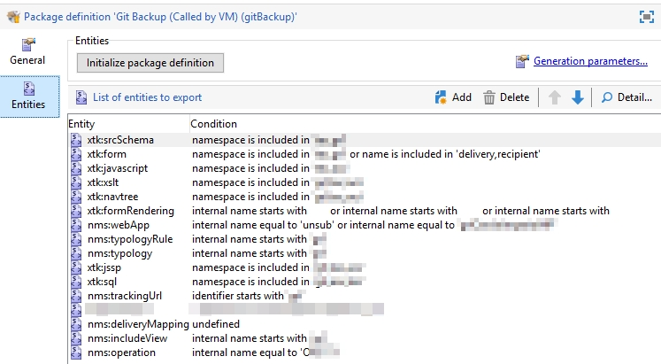

# Adobe Campaign Sync to Git by Florian Courgey
Synchronize any object (Schema, Form, JSSP...) from Adobe Campaign to your own Git repo (Github, Bitbucket...).


## Changelog

- 0.0.2: Added .env as a command line arg for multi instances handling, Removed git.js
- 0.0.1: First release

## Installation

## Prerequisites
- Install NodeJS v12 LTS (https://nodejs.org/en/):
```console
$ node -v # v12.13.1
$ npm -v # v6.12.1
```
- Create a git repo to track your instance changes (on github/gitlab/bitbucket..) and init it with an empty file like a README.md
- Create a package on your instance, based on the objects you want to track in git:


## Step 1. Install adobe-campaign-sync

All instructions on [https://blog.floriancourgey.com/2020/03/adobe-campaign-to-git](https://blog.floriancourgey.com/2020/03/adobe-campaign-to-git)

## Todo
- [ ] workflows (& campaign) with dates such as lastProcessingDate
- [ ] workflows (& campaign) are minified, should we separate `><` into `>\n<`?

## Objects directories:
- [x] `xtk:srcSchema`, /Administration/Configuration/Data schemas/{namespace}/
- [x] `xtk:form`, /Administration/Configuration/Input forms/{namespace}/
- [x] `xtk:navtree`, /Administration/Configuration/Navigation hierarchies/{namespace}/
- [x] `xtk:javascript`, /Administration/Configuration/JavaScript codes/{namespace}/
- [x] `xtk:jssp`, /Administration/Configuration/Dynamic JavaScript pages/{namespace}/
- [x] `xtk:formRendering`, /Administration/Configuration/Form rendering/
- [x] `xtk:sql`, /Administration/Configuration/SQL scripts/{namespace}/
- [x] `xtk:xslt`, /Administration/Configuration/XSL style sheets/{namespace}/
- [x] `xtk:workflow`, /Administration/Production/
- [x] `nms:typology`, /Administration/Campaign Management/Typology management/Typologies/
- [x] `nms:typologyRule`, /Administration/Campaign Management/Typology management/Typology rules/
- [x] `nms:trackingUrl`, /Resources/Online/Web tracking tags/
- [x] `nms:webApp`, /Resources/Online/Web applications/
- [x] `nms:deliveryMapping`, /Administration/Campaign Management/Target mappings/
- [x] `nms:includeView`, /Resources/Campaign Management/Personalization blocks/
- [x] `nms:operation`, /Campaign Management/Campaigns/

Note: Workflows and Campaigns will be pretty-printed using [pretty-data](https://www.npmjs.com/package/pretty-data)
